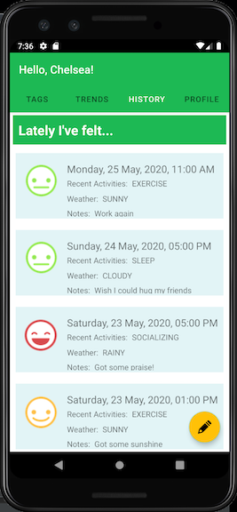

# Android-Mood-Tracker

## Description
An Android mobile app that allows users to enter their moods. Mood data and trends are then displayed.

## Stack
Kotlin Android app created with Android Studio.

## Lessons Learned
This was the first Kotlin app I created so I got exposure to the Kotlin programming language and gow to use Android Studio.

The next step is to set up a secure data server and deploy to the app store.
